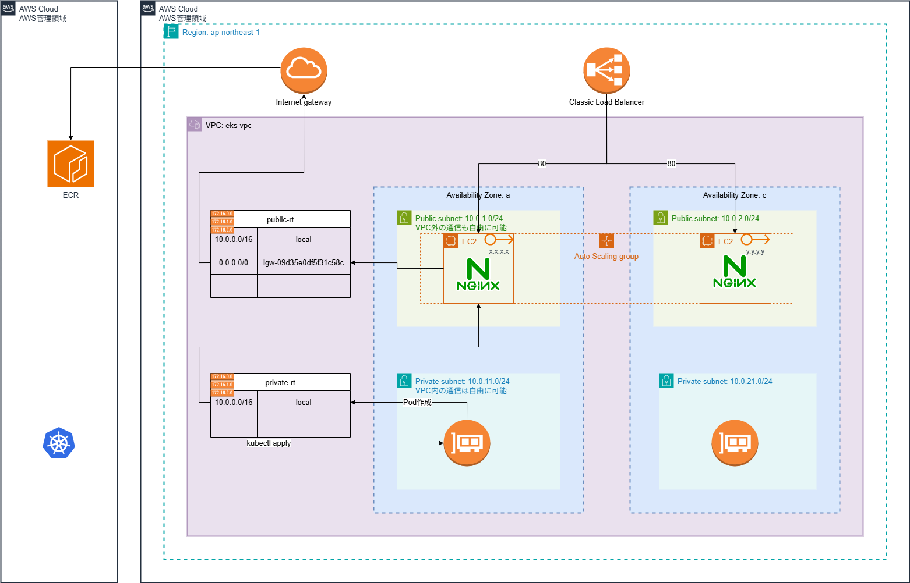

# AWS EKS

## 構成図



## 使い方

### awsへの接続

```console
$ aws login
```

terraformが認証情報を取れない場合、環境変数化しておくことで自動で参照してくれる。

```console
$ eval "$(aws configure export-credentials --format env)"
```

### ローカルで使う場合

```console
$ terraform init -backend=false
```

### S3を使う場合

S3バケットを設定する。

```console
$ terraform init -backend-config=backend.hcl
```

### デプロイ

事前チェック

```console
$ terraform fmt
$ terraform validate
```

現環境との差分チェックと適用。

```console
$ terraform plan
$ terraform apply -auto-approve
```

> デプロイに10分ぐらいかかるので休憩に入って良い。

### kubectlの接続

`kubectl`でEKSを操作するには、`kubectl`にAPIサーバーの場所を教える必要がある。

```console
$ aws eks update-kubeconfig --region ap-northeast-1 --name sample-eks
Added new context arn:aws:eks:ap-northeast-1:396765697248:cluster/sample-eks to /home/vscode/.kube/config
```

これで`kubectl`はAWSの接続先を認識できた。

```console
$ kubectl get nodes
NAME                                           STATUS   ROLES    AGE   VERSION
ip-10-0-2-92.ap-northeast-1.compute.internal   Ready    <none>   13m   v1.36.3-eks-cb19647
```

`kubectl`でAWS EKSに接続できた事がわかる。

### nginx への接続

nginx直接ではなく、前段にいるLBを経由する。  
そのため、LBのドメインを確認しよう。

```console
$ kubectl get service backend-nginx
NAME            TYPE           CLUSTER-IP      EXTERNAL-IP                                                                    PORT(S)        AGE
backend-nginx   LoadBalancer   172.20.23.237   acc0ab40dbb2246aeaad9c8ba4f01922-1496325170.ap-northeast-1.elb.amazonaws.com   80:32582/TCP   55s
```

```console
$ curl http://${EXTERNAL-IP}
<!DOCTYPE html>
<html>
<head>
<title>Welcome to nginx!</title>
<style>
html { color-scheme: light dark; }
body { width: 35em; margin: 0 auto;
font-family: Tahoma, Verdana, Arial, sans-serif; }
</style>
</head>
<body>
<h1>Welcome to nginx!</h1>
<p>If you see this page, nginx is successfully installed and working.
Further configuration is required for the web server, reverse proxy, 
API gateway, load balancer, content cache, or other features.</p>

<p>For online documentation and support please refer to
<a href="https://nginx.org/">nginx.org</a>.<br/>
To engage with the community please visit
<a href="https://community.nginx.org/">community.nginx.org</a>.<br/>
For enterprise grade support, professional services, additional 
security features and capabilities please refer to
<a href="https://f5.com/nginx">f5.com/nginx</a>.</p>

<p><em>Thank you for using nginx.</em></p>
</body>
</html>
```

## 問題点

EKSにおいてServiceとはClassic Loadbalancerを指すようだ。

```yaml
apiVersion: v1
kind: Service
metadata:
  name: backend-nginx
spec:
  type: LoadBalancer
  (略)
```

```console
 $ aws elb describe-load-balancers --region ap-northeast-1 --query 'LoadBalancerDescriptions[*].LoadBalancerNa
me'
[
    "ab873fa2b79d64547a3f12278ac16228",
    "a57d5d277504c4b24bc58b5679e8b4fa"
]
```

> ALBたちは`aws elbv2`コマンドを用いる。

### 解決策

EKSでALBを使いたい場合はingressを構築する必要があるようだ。
